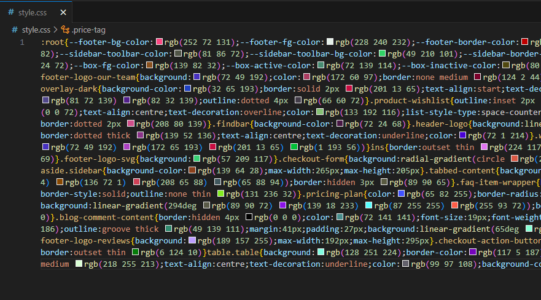
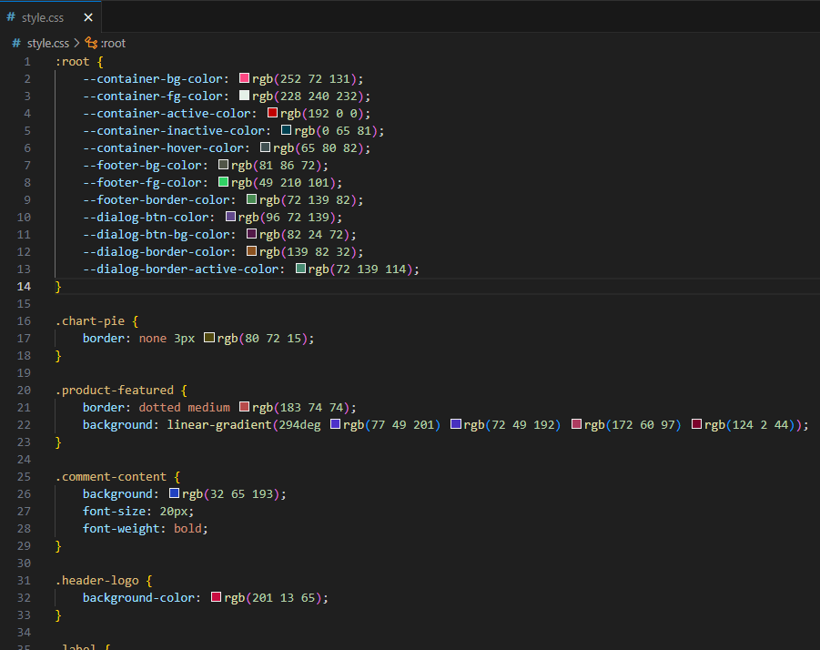
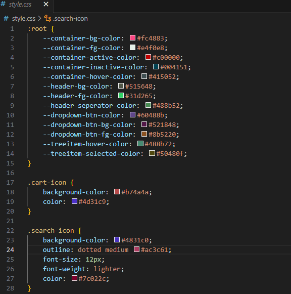

<div align="center">

# **CSSHide**

<br />

`CSSHide` is a tool for encoding a payload inside a mock-CSS file using CSS colour values with the aim of blending into common network traffic - Hiding in plain style.

<br />


<br>

[](https://twitter.com/inbits_sec)

</div>
<hr />

## **Installation**

```
C:\> git clone https://github.com/inb1ts/CSSHide.git
C:\> cd CSSHide
C:\> python .\csshide.py --help
```

## **Usage**

Supports two different formats of CSS colour attribute:

- rgb - `rgb(1 2 3)`
- hex - `#ffffff`

The payload is split into 3-byte chunks and encoded into these values before being placed amongst other randomly generated CSS attributes. The output can be minified to reduce size - as is occasionally done with legitimate CSS files - or left as the default format.

```
C:\>python.exe csshide.py -h
usage: csshide.py PAYLOAD_FILE [-h] [-f {rgb, hex}] [--no-minify] [-o OUT_FILE]

CSSHide encodes a payload in CSS colour values. Supports either rbg or hex CSS colour formats, and
minified/normal output.

positional arguments:
  payload               the payload file payload you want to encode

options:
  -h, --help            show this help message and exit
  -s SELECTORS, --selectors SELECTORS
                        CSS selector wordlist
  -f {rgb,hex}, --format {rgb,hex}
                        format of CSS color
  --minify, --no-minify
                        minify output to save space (default: True)
  -o OUTFILE, --outfile OUTFILE
                        name of output file to create
```

An example of fetching the CSS file from a server and decoding it in C (and using the WinAPI) can be found in the `example_decode` directory.

## **Example output**

#### Minified rgb

- `csshide.py calc.bin`



#### Non-minified rbg
- `csshide.py calc.bin --no-minify`



#### Minified hex
- `csshide.py calc.bin -f hex`


#### Non-minified hex
- `csshide.py calc.bin -f hex --no-minify`



## **Limitations**

- **Size** - Legitimate CSS files usually aren't too large, so whilst the tool will still work with a large payload (tested with Havoc agent shellcode of 95kb), the outputted file will look comically large for a CSS file and would definitely turn some heads. 
- **Limited selection of CSS properties and values** - The randomised CSS properties and values are pulled from a hardcoded list that does not encompass all possible CSS properties.
- **Can't currently blend between `rgb` and `hex` formats** - It's one or the other at the moment.

## **Resources/Credits**

- Shout out to [Maldev Academy](https://maldevacademy.com) - the modules on payload encoding gave me the idea to try this.